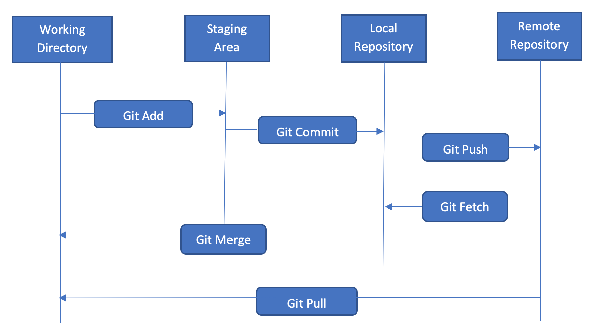
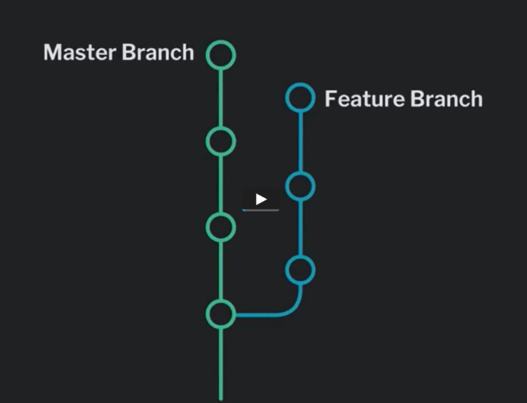

# **GitItDone**

Slides voor GitItDone workshop van het IT-lab

---

<!-- Link naar Marp documentatie: https://marpit.marp.app/ -->

<!-- # How to write slides

Split pages by horizontal ruler (`---`). It's very simple! :satisfied:

```markdown
# Slide 1

foobar

---

# Slide 2

foobar
```

--- -->


---


# Wat is Git?
- Git is een version control system (VCS)
  - Hou een historie bij van je project en alle wijzigingen
  - Wijzigingen worden systematisch bijgehouden
  - Keer eenvoudig terug naar oudere versies (handig bij fouten...)
  - Leuk om evolutie en voortgang van project te zien

---

# Een beetje geschiedenis...

- Ontworpen en uitgebracht in 2005
- Gemaakt door Linus Torvalds voor development van Linux
- Grote populariteit en meestgebruikte VCS vandaag de dag


---

# Git installeren

- Beschikbaar voor Windows, MacOS en Linux (uiteraard)
  - Download voor jouw systeem de juiste [versie](https://git-scm.com/downloads)
  - Windows: [Git Bash](https://gitforwindows.org/) is ook een optie


---

# Git configureren

- Email en naam instellen
```
 git config –global user.name <USERNAME>
```
```
 git config –global user.email <JOUW@EMAIL.ADRES>
 ```
- Gebruikersnaam en email - laat deze matchen met jouw GitHub-account! (zie later)

- Mensen die meerdere accounts hebben: lokaal versus globale git config!

---

# Git configureren - SSH sleutels

- Waarvoor dienen SSH-sleutels? (kort)
  
- Hoe genereer ik zo'n sleutelpaar? `ssh-keygen` 
- Modern sleutelpaar: `ssh-keygen -t ed25519`

- Public key toevoegen aan GitHub (demo?)

- Extra: je kan verschillende keypairs gebruiken voor verschillende accounts/repo's! (voorbeeld Emilia)

---

# Demo GitHub - account en keypair

- Maak een GitHub account (indien nog geen...)
- Genereer een SSH-sleutelpaar (LET OP! check eerst of er eentje bestaat...)
- Test met `ssh -T git@github.com`

---
# Git - commits

- Om veranderingen bij te houden, maken we gebruik van *commits*
- Commits bevatten één of meerdere wijzigingen in onze repository
- Commits hebben altijd een bijhorende *commit message*
- Commits hebben altijd een unieke *commit hash*
<!-- - Uitleg dat alle veranderingen worden bijgehouden in een 'commit'
- Elke commit krijgt dan ook een commit hash (lange en korte eens uitleggen)
- In een commit kunnen meerdere veranderingen tegelijk zitten -> we proberen ze allemaal atomair te houden!
- Commit messages - BELANGRIJK!!!
- Wat is HEAD en HEAD(~1) -->

---

# Commits - tips en best practices

- Probeer je commits *atomair* te houden! (commit heeft een doel)
- Schrijf duidelijke commit messages!
- Kom tot overeenkomst/structuur met jouw team (samenwerken)

---

# Wat is een .gitignore bestand?

- Soms wil je sommige zaken niet bijhouden in jouw version control (denk aan wachtwoorden, sensitieve data,...) 

- .gitignore definieert wat je niet wilt tracken (voorbeeld met demo!)

- Er bestaan heel wat templates voor verschillende projecten!

---

# .gitignore - voorbeeld Java project
```
# Compiled class file
*.class

# Log file
*.log

# Package Files
*.jar
*.war
*.nar
*.ear
*.zip
*.tar.gz
*.rar
```

---
# Git workflow



<!-- - Veranderingen bijhouden en zo doen aan version control!
- Met remote: zelfde concept, maar collaboratief!
- Meerdere slides hiervan maken hoor! -->
<!-- IMG source: https://www.dezlearn.com/getting-started-with-git/ -->


---

# Git - command line versus GUI

- Git kan je zowel via de CLI als GUI gebruiken

- CLI: snel en efficiënt, iets hogere learning curve (maar niet veel!)

- GUI: handig voor een visueel overzicht, maar er gebeurt veel *under the hood*

<!-- ---


# Git - command line en basiscommando's

- git clone
- git fetch
- git pull
- git add
- git commit 
- git push (remote nodig!) -->

---
# Basiscommando's - algemeen

- Huidige toestand/situatie bekijken
```
git status  
 ```
 Gebruik dit commando na/voor elk ander commando!!

- Historie/commits weergeven
```
git log
```

---

# Basiscommando's - lokaal
- Van een lokale map een git repository maken
```
git init
```
- Een repository binnenhalen (klonen)
```
git clone <URL>
```
- Wijzigingen in working directory aan staging toevoegen
```
git add <FILE>
```


---


# Basiscommando's - lokaal

- Alles toevoegen aan staging
```
git add .
```
- Wijzigingen in stage aan de lokale git-repository toevoegen

```
git commit
```

- Meteen een (duidelijke!) commit message toevoegen
```
git commit -m "DIT IS MIJN COMMIT MESSAGE"
```

---


# Basiscommando's - lokaal

- Lokale git-repository naar working directory
```
git merge
```

---

# Basiscommando's - lokaal

- Unstagen van wijziging
```
git reset
```

- Recentste commit ongedaan maken
```
git reset HEAD~1
```

- Commit reverten met nieuwe commit
```
git revert
```
<!-- TO DO beter uitleggen in slides! -->

----
# Basiscommando's - remote

- Lokale repository naar een remote repository
```
git push
```
Tip: stel pushen niet uit! Vermijd merge conflicten (zie later)

- Remote repository naar lokale repository
```
git fetch
```

Belangrijk! Je moet een remote repository ingesteld hebben

--- 

# Basiscommando's - remote

- Checken of er een remote is ingesteld

```
git remote
```

- Remote toevoegen aan lokale repository (bv origin)
```
git remote add origin <URL>
```

- Remote repository naar lokale werkomgeving (fetch + merge)

```
git pull
```

---


# Order matters...


--- 
# Demo basic workflow

- Klassieke git workflow
```
git add .

git commit -m "Fix myFunction function: supports multiple parameters now"

git pull

git push
```

---


# Git - branches

- Ruimte voor tekst, uitleg en/of oubollige meme?



---
# Branches - commando's

- Nieuwe branch aanmaken

```
git branch <NAAMBRANCH>
```
- Wisselen naar branch 
```
git checkout <NAAMBRANCH>
```
OF
```
git switch <NAAMBRANCH>
```

---


# Git - merge conflicten

- Wat zijn merge conflicten? 
- Wanneer ontstaan deze?
- Hoe kan je deze oplossen (BELANGRIJK - demo!!)

---

# Demo merge conflict

Laat ons eens een merge conflict veroorzaken en ook oplossen...

---
# Git - samenwerken

- Nood aan een remote repository!
- GitHub is een voorbeeld van zo'n provider/platform
- Git != GitHub
- Alternatieven bestaan ook (GitLab, Gitea, ...)


---

# GitHub specifiek

- Heel wat specifieke mogelijkheden binnen het platform
- GitHub Actions: automatisatie, testen en meer
- GitHub Pages: host statische websites en projecten gratis
- Webhooks: stel meldingen in voor veranderingen in repository (Discord, Slack, mail, ...)
- Pull requests: review en bekijk code/wijzigingen voor een push


---

# GitHub pages

- Manier om statische websites te hosten
- Use case: deze slides! (in combinatie met GitHub Actions)
- Eenvoudige websites, basic applicaties, ...

---


# Git - advanced topics 

TO DO

- git rebase: in detail eens overgaan
<!-- - Meer advanced commando's? -->
- GitKraken of andere GUI tool demonsteren?
<!-- - Website hosten met GitHub pages -> kan gratis voor statische sites (zie huidige slides) -->
- DEMO's van vanalles moeten nog toegevoegd worden! (repo's, specifieke flows, use cases,...)

---

## Handige/interessante links

- Git(Hub) guide van HOGENT - https://hogenttin.github.io/git-hogent-gids/
- Leren branchen - https://learngitbranching.js.org/
- Templates .gitignore - https://github.com/github/gitignore
- Wat als het allemaal in de soep loopt? - https://ohshitgit.com/